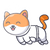

<h1 align="center">adoteAqui 🐾</h1>

**adoteAqui // RESILIAPet** é o segundo projeto proposto pela **@RESILIA Educação**, na qual integro a T17, com a finalidade de praticar conceitos de HTML, CSS e versionamento de código com GIT.  
A página web desenvolvida atua como uma vinitre de doação de animais para a ONG **adoteAqui**, contando com descrições e animações em CSS para interagir com o usuário final. 
 
 

## → **Header;**  
A proposta inicial era construir um header alinhado, que fosse responsivo (utilizando @media queries) e animado com pseudo-seletores. Os desafios eram:   
- Declarar uma @media querie que para visualizações com menos de 700 pixels de largura: esconda o logo e disponibilize em coluna os elementos da barra de navegação;
- Aumentar o logo/nome "Adote Aqui" ao passar o cursor do mouse por cima;
- A mudança de cor na fonte dos demais elementos do cabeçalho.

Com auxilio do [Guia da Responsividade](https://kinsta.com/pt/blog/design-responsivo-web/) e com o post [12 passos para responsividade](https://www.linkedin.com/feed/update/urn:li:activity:6916716250224046081/), foi possivel implementar a responsividade de forma simples e utilizando dicas e insights valiosos, como: 

    @media (max-width:1200px) {

    html {
        font-size: 55%;
    }
        }

Ao definir o ***font-size*** do navegador como 55%, é possivel utilizar REM como forma de unidade padrão para textos, deixando o código responsivo em poucas linhas.   
É primordial abandonar medidas como o *pixel* para um site orgânico e fluído.  

Para transformar o *menu de navegação* em uma coluna, utilizei a propriedade:  
 
        flex-flow: column-reverse; 

Para deixar o *header* fixo na página, utilizei a propriedade:  

        position: fixed; 

Para prover o efeito de **aumentar o nome/logo** ao passar o cursor do mouse, utilizei: 

      .botao-main:hover {
    transform: scale(1.1);
    transition: all 0.5s;
    } 
   
## → **Declarando variáveis de cor;**  

Com auxilio da [Documentação Mozilla CSS](https://developer.mozilla.org/pt-BR/docs/Web/CSS/Using_CSS_custom_properties), apliquei através da pseudo-classe ***:root***, variáveis de cor, para agilizar a codificação. 

    :root{ 
    --orange: #FF891D;
    --purple: #87499b;
    --gradient: linear-gradient(90deg, var(--orange), var(--purple));
        
    }

## → **Animações com @keyframes;**

    @keyframes float {
    0%, 100% {
        transform: translateY(0rem);
    }
    50% {
        transform: translateY(-3.5rem);
    }
    }

Através do artigo [CSS Floating Animation](https://www.geeksforgeeks.org/css-floating-animation/), foi possível implementar o efeito flutuante no logotipo da *landing page*. Além disso, aprofudendei os conhecimentos em **animações e transições CSS* com o [Mini-Curso Animações CSS](https://www.youtube.com/watch?v=eTELLTacg-8&t=68s), disponibilizado de forma gratuita no Youtube. 

## → **Parte principal;**  
Após a landing page, comecei a trabalhar na montagem das imagens e descrições através da propriedade:  
 
     display: flex;

O site segue um padrão de estilização de *containers* e *items*, todos baseados no seguinte trecho de código: 

    .pets .box-container .box{
        flex:1 1 30rem;
        background:#fff;
        border-radius: .5rem;
        border:.1rem solid rgba(0,0,0,.2);
        box-shadow: 0 .5rem 1rem rgba(0,0,0,.1);
        margin:1.5rem;
        padding:3rem 2rem;
        border-radius: .5rem;
        text-align: center;

    }
    
 ## → **Depoimentos;** 
O site conta, ainda, com uma página de depoimentos, seguindo a mesma estilização da vitrine principal de animais. 

  

As imagens utilizadas em todos os *containers* são de direitos autorais livres, retiradas da biblioteca [Unsplash](https://unsplash.com/). 

## → **Sobre nós & Footer**; 

O *"sobre nós"* foi estilizado com *flex-box*, seguindo o seguinte código: 

    .about{
    background-size: cover;
    background-position: center;
    padding-bottom: 3rem;
    }

    .about .column{
    display: flex;
    align-items: center;
    justify-content: center;
    flex-wrap: wrap;
    }

O *footer* foi produzido utilizando sua própria TAG;  
**HTML code:** 

    <footer class="main-footer">
    
    <h3 class="title">ADOTE AQUI: RESILIAPet</h3>
    </footer>    

**CSS code:** /1parte 

    .main-footer {
    display: flex;
    align-items: center;
    flex-direction: column;
    padding-bottom: 20px;

Também alinhado com *flex-box*. 

## → **Menu type "Hamburguer";** 🍔

*Criando essa variação de menu apenas com CSS & HTML*

Como referência, consultei as seguintes fontes:  
- [How to creat menu hamburguer](https://vidafullstack.com.br/html/como-criar-um-menu-hamburguer-com-html-e-css/)  

Esse atributo foi utilizado para administrar a forma como as medias queries em <700 iriam funcionar, é uma forma de trabalhar com um web design responsivo. 

Utilizei a biblioteca de ícones para pegar o *menu bar*: [Font Awesome](https://fontawesome.com/v5/icons/font-awesome-logo-full?s=solid) 

## → **Creation and Design;**
                                                                                    

                                                                    
                                                                                    
                                                                                    
## → **Conclusão;** 
Em suma, **adoteAqui** foi um projeto desafiador, onde pude exercitar e conhecer ínumeros conceitos, recorrer à comunidade quando necessário, e absorver informações e aprendizados valiosos para uma trajetória embasada no desenvolvimento web. 

